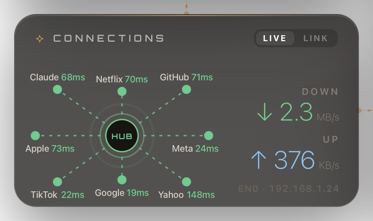
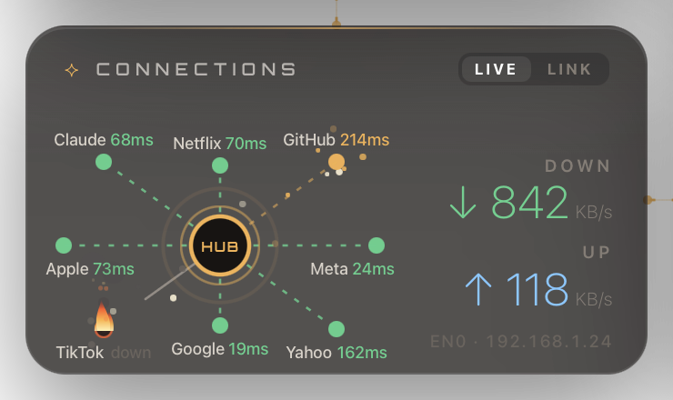
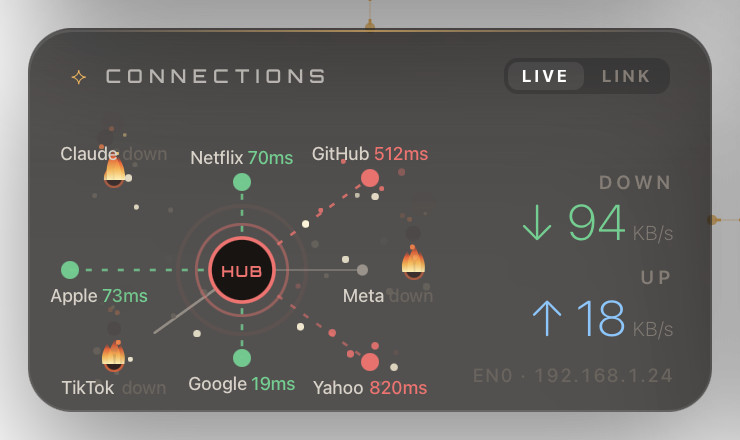
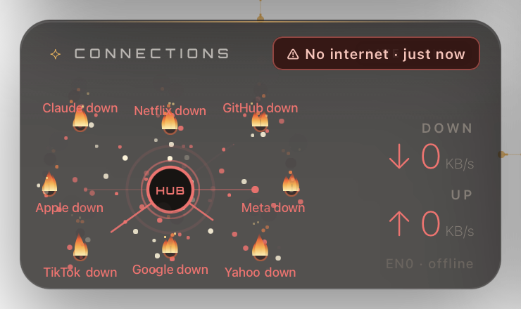

# Desktop Dashboard

A macOS desktop dashboard built on [Übersicht](https://tracesof.net/uebersicht/), with tech markets, AI news, weather, unread mail, git projects, system stats and network connections, plus a matching terminal theme.

Everything is plain scripts: no API keys, no paid services, no AI calls.

**Look and feel:** refined dark "liquid glass" panels (frosted, translucent, a soft light that follows the cursor), thin SF numerals, small Orbitron titles, one amber accent with an amber hairline across the top of each panel. `wallpaper_glass.py` generates the matching dark wallpaper. Over the widgets the cursor becomes a crosshair with a trailing targeting ring and click ripples.

**Interactive:** the panels are chained in place. Pull one by its header (or the clock from anywhere) and its chains stretch; let go and it springs back home. Click stocks, headlines, projects or emails to open them.

## Widgets

| Widget | Shows | Data source | Refresh |
|---|---|---|---|
| Clock | Time, date, New York / London / Tokyo market sessions | System clock | 1 s |
| Weather | Nairobi now + 5-day forecast | [Open-Meteo](https://open-meteo.com) | 15 min |
| System | CPU, memory, disk, battery | `top`, `memory_pressure`, `df`, `pmset` | 10 s |
| Connections | Live health of 8 services around a HUB, throughput, Wi‑Fi / VPN / speed test | Python sockets, `netstat`, CoreWLAN, `networkQuality` | 30 s |
| Tech Markets | NASDAQ 5-day chart + 11 tech stocks ranked by market cap | Yahoo Finance | 5 min |
| AI & Tech Wire | Tech headlines, AI stories first | CNBC Tech + Yahoo RSS | 15 min |
| Batcave | Git projects in `~/Documents/GitHub` and `~/Developer` | `git` | 1 min |
| Mail | Unread Primary emails, Gmail / iCloud tabs | Gmail IMAP + Mail.app (AppleScript) | 30 s |
| Tech Movers | More tech stocks ranked by today's move | Yahoo Finance | 5 min |

A launchd agent tells Mail.app to sync every 10 minutes and whenever the network changes (`mail-sync.sh`).

## Connections widget

Every 30 seconds `network.sh` times a DNS lookup + TCP connect to port 443 for each service (no page download), samples
throughput over one second, and the panel draws each service as a node wired to a central **HUB**.

| Healthy | Mild |
|---|---|
|  |  |
| Every service answers under its own limit. Lines flow green and the HUB pulses green. | A link is slow (amber, flickering, throwing sparks) and/or one service is down. A down service loses its line and burns while the HUB keeps reaching out to it. The HUB turns amber (grey if the only problem is one down service). |

| Unhealthy | Offline |
|---|---|
|  |  |
| Two or more services are down, or a link is past its red limit. The HUB turns red and beats faster. | Every service is down or there is no IP. The whole panel goes red with sparks everywhere and a red **No internet** badge appears in the header. |

**Colours per service:** green under the amber limit, amber up to the red limit, red above it, burning when the connection fails (3 s timeout).
The limits live in `LIMITS` in `build_widgets.py`, as `[amber from, red from]` in ms. They are tuned for Nairobi
(Meta/TikTok/Google `90/250`, Apple/Netflix/Claude/GitHub `150/400`, Yahoo `300/750`, anything else `150/450`).
Measure your own normal times with `~/.stark/network.sh` and set amber to about 2× and red to about 5× those.

**Changing the services:** edit `HOSTS` in `network.sh` (`("Name", "host.com")`, up to 8). Their order is the node
position in the ring; the 7th and 8th sit top and bottom centre, so give those short names. Add a `LIMITS` entry for any
new name, then run `python3 ~/.stark/build_widgets.py`.

**LINK view** (toggle in the header): Wi‑Fi signal, channel and link rate, VPN state, public IP and ISP (from
[ipinfo.io](https://ipinfo.io), refreshed every 10 min) and the last speed test (macOS's built‑in `networkQuality`,
every 3 hours, skipped on an iPhone hotspot; ↻ runs one now). macOS hides the Wi‑Fi name from scripts, so to show it
create a **Shortcuts** shortcut named exactly `Wi-Fi Name` containing the single action *Get Network Details*
(Network Name of Wi‑Fi). Without it the panel says *Name hidden*.

## Install

Requirements: macOS 13 or later, [Homebrew](https://brew.sh), and the Xcode Command Line Tools
(`xcode-select --install`, needed to compile the small Swift helpers `wifi` and `hudcursor`). Python 3 comes with
the Command Line Tools; no pip packages are used.


```sh
git clone https://github.com/nambiropeter/ubersicht-hud-dashboard ~/.stark
~/.stark/install.sh
```

The repo **must** live at `~/.stark` (the widgets call their scripts from there). `install.sh` installs Übersicht
(via Homebrew), compiles the Swift helpers, generates the widgets and loads the background agents (mail sync and the
pointer hider). Open Übersicht once and allow it in **System Settings → Privacy & Security** if macOS asks.
To use it only for the Connections widget, delete the other `.jsx` files from
`~/Library/Application Support/Übersicht/widgets/` (they come back on the next rebuild).

Troubleshooting:
- **Panels blank:** quit and reopen Übersicht (`open -a Übersicht`).
- **Red sync badge on a panel:** its script failed or stopped updating; run it by hand (e.g. `~/.stark/network.sh`) to see the error.
- **Layout off on your screen:** the `POS` grid is laid out for a 1470×956 pt screen (13" MacBook Air); adjust it in `build_widgets.py`.
Optional terminal theme (prompt, aliases, `stocks`, `news`, `alfred`, `jarvis`):

```sh
echo 'source ~/.stark/stark.zsh' >> ~/.zshrc
```

macOS will ask once to let Übersicht and `osascript` control **Mail**.

**Mail without the Mail app:** store an app password for each account in the Keychain (never written to a file),
and `mail_direct.py` reads it straight from the server:

```sh
# Gmail (shows Gmail's real Primary tab): https://myaccount.google.com/apppasswords
security add-generic-password -U -s desktop-widget-gmail -a you@gmail.com -w
# iCloud (every unread inbox email, unfiltered): account.apple.com → App-Specific Passwords
security add-generic-password -U -s desktop-widget-icloud -a you@icloud.com -w
```

An account without one is read from Mail.app instead, as is, and only while Mail is open.

## Customize

All widgets are generated from **`build_widgets.py`**, so edit it and run `python3 ~/.stark/build_widgets.py`.

- **Layout:** the `POS` grid at the top (laid out for a 1470×956 pt screen)
- **Stocks:** `SPARK` (main panel) and `MOVERS` in `market.py`
- **Weather location:** `LAT`/`LON` in `weather.sh`

## Files

```
build_widgets.py   generates all Übersicht widgets
market.py          quotes, sparklines, market caps, news (stdlib only)
weather.sh         Open-Meteo forecast
system.sh          CPU / memory / disk / battery
network.sh         IP, throughput, service latency, Wi-Fi / VPN / public IP
speedtest.sh       cached networkQuality speed test
wifi.swift         Wi-Fi link details (CoreWLAN)
hudcursor.swift    hides the system pointer over panels
batcave.sh         git project status + commit activity
mail.sh            unread Primary mail from Mail.app
mail_direct.py     Gmail Primary + iCloud over IMAP (app passwords from Keychain)
mail-sync.sh       syncs Mail.app accounts (run by launchd)
launchd/           background agents (mail sync timer + network change, pointer hider)
docs/              screenshots
stark.zsh          terminal theme
dashboard.html     browser market dashboard (TradingView widgets)
wallpaper.py       generates the bat-signal × arc-reactor wallpaper
install.sh         one-shot setup
```

## Uninstall

```sh
launchctl bootout gui/$UID/com.stark.mailsync.timer
launchctl bootout gui/$UID/com.stark.mailsync.network
launchctl bootout gui/$UID/com.stark.hudcursor
rm ~/Library/LaunchAgents/com.stark.*.plist
rm ~/Library/Application\ Support/Übersicht/widgets/*.jsx
```
